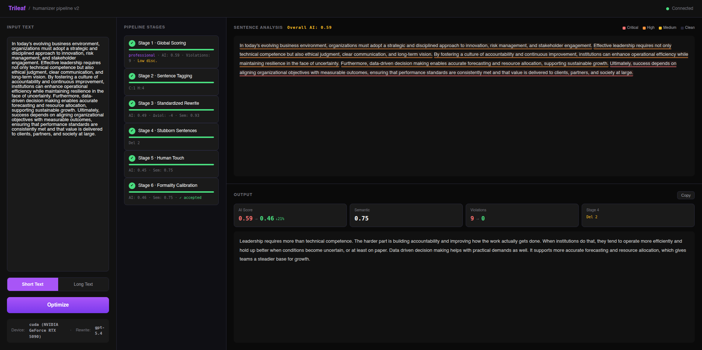
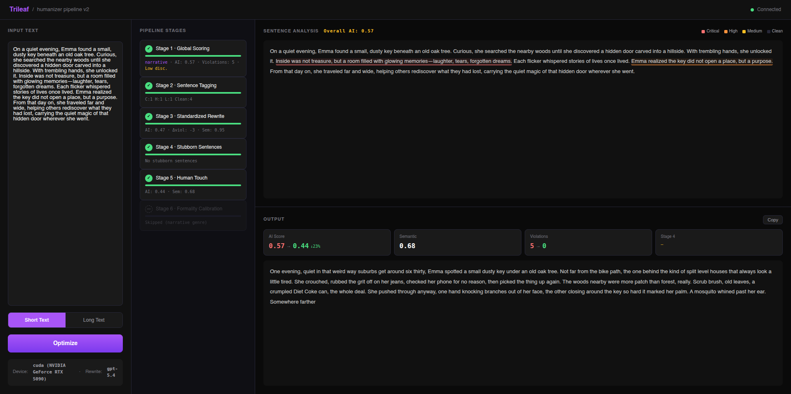
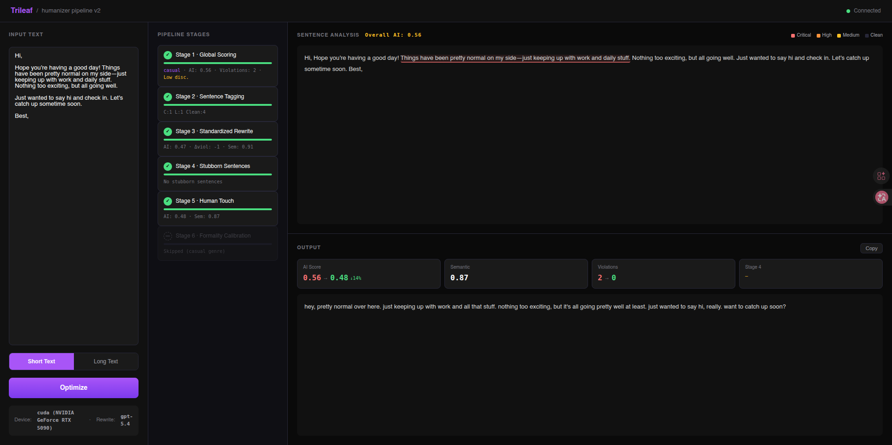

# Trileaf

**Trileaf** is a genre-aware writing humanization pipeline. It takes AI-generated text and rewrites it to sound naturally human-written, adapting its strategy to the genre of the input: academic papers, cover letters, creative fiction, casual messages, or opinion pieces.

It is not locked to a single model. Bring the rewrite model you already trust, and Trileaf wraps it in a structured six-stage pipeline: rule-based detection, AI-score-guided rewriting, multi-candidate selection, and genre-specific humanization with formality calibration.

Scoring uses two local Hugging Face models: [`desklib/ai-text-detector-v1.01`](https://huggingface.co/desklib/ai-text-detector-v1.01) for AI-probability estimation and [`sentence-transformers/paraphrase-mpnet-base-v2`](https://huggingface.co/sentence-transformers/paraphrase-mpnet-base-v2) for semantic similarity. The detection model is pluggable via an abstraction layer.

## Preview

**Formal writing** (cover letter, academic) — rule violations highlighted, formality calibration active:



**Narrative writing** (fiction, personal blog) — aggressive humanization, sentence fragments, brand-name grounding:



**Casual writing** (Slack, email to colleagues) — stripped to essentials, fragments, informal tone:



---

## How the pipeline works

### Six-stage architecture

```
Input Text
  │
  ▼
Stage 1  Global Scoring       AI detection score + rule violation analysis + genre detection
  │
  ▼
Stage 2  Sentence Tagging     Per-sentence severity (rule violations + AI heat percentile)
  │
  ▼
Stage 3  Standardized Rewrite Multi-candidate rewrite with genre-aware rules, best candidate selected
  │
  ▼
Stage 4  Stubborn Sentences   Targeted attack on sentences that survived Stage 3 (rewrite / delete / flag)
  │
  ▼
Stage 5  Human Touch          Genre-specific humanization techniques with dynamic budget
  │
  ▼
Stage 6  Formality Calibration Restore appropriate formality for academic/professional text (conditional)
  │
  ▼
Output
```

### Genre-aware rewriting

Trileaf uses the rewrite model itself to classify the input into one of five genres, then loads genre-specific rules and humanization guidelines:

| Genre | Triggers | Key rewrite strategy |
|-------|----------|---------------------|
| **Academic** | Essays, papers, reports, case studies | Break formulaic paragraphs, replace abstract noun chains, delete transition word overuse |
| **Professional** | Cover letters, formal emails, LinkedIn, proposals | Replace buzzwords with specifics, violate templates, add honest qualifiers |
| **Casual** | Slack/Teams messages, texts, informal emails | Cut length aggressively, use fragments, drop formality entirely |
| **Narrative** | Fiction, blogs, personal essays, stories | Cut adjectives, add brand names, sentence fragments, dead time, narrator voice |
| **Persuasive** | Op-eds, reviews, arguments, commentary | State positions directly, emotional spikes, dismiss weak counterarguments |

A universal rule set applies to all genres (sentence rhythm variation, no dashes, specificity over generality, technique rotation). Genre supplements add genre-specific guidance on top.

### Multi-candidate selection (Stage 3)

Stage 3 generates two rewrite candidates at different temperatures and selects the one with the lowest AI detection score:

```
Candidate A (temp=0.7)  → detector score + semantic similarity
Candidate B (temp=0.9)  → detector score + semantic similarity
→ Select: lowest AI score among viable candidates (semantic > 0.5, length within ±40%)
```

If the first round doesn't reduce the AI score by at least 15%, a retry round runs with more aggressive prompts and different temperatures. This combines the precision of structured prompts with the exploration benefits of temperature diversity.

### Formality calibration (Stage 6)

For academic and professional text, Stage 5's humanization can sometimes overshoot into informality. Stage 6 runs a conditional formality pass that restores appropriate tone while preserving the rhythm variation and structural changes that fool detectors. If the formality pass increases the AI score by more than 0.05, it is automatically rejected.

For casual, narrative, and persuasive text, Stage 6 is skipped.

### Detection model strategy

AI detection scores guide the pipeline but don't gate it. Even when the detection model has low discrimination (scores clustered in a narrow range), Trileaf uses **percentile ranking** rather than absolute thresholds:

- **AI-hot** (top 20% by score) — needs the most rewriting
- **AI-warm** (next 30%) — needs attention
- **Low** (bottom 50%) — light touch

This works regardless of whether the model outputs scores in a 0.3-0.5 range or a 0.1-0.9 range. The detection model interface is pluggable (`BaseDetector` ABC) for easy replacement.

---

## Requirements

| Requirement | Notes |
|-------------|-------|
| Python 3.10+ | 3.12 recommended |
| **LeafHub** | API key management — install first (see below) |
| Internet connection | First-time model download (~0.9 GB) and API calls |
| CUDA GPU | Optional — detection models run on CPU, MPS, or CUDA |

Trileaf uses **[LeafHub](https://github.com/Rebas9512/Leafhub)** for encrypted API key management. LeafHub must be installed and configured before you can run Trileaf. Head to the LeafHub repo to install it and add your provider credentials — the process takes about two minutes.

Trileaf supports three API backends:

| Backend | LeafHub `api_format` | Notes |
|---------|---------------------|-------|
| OpenAI Chat Completions | `openai-completions` | OpenAI, Groq, vLLM, any OpenAI-compatible endpoint |
| OpenAI Responses API | `openai-responses` | ChatGPT Codex endpoint — uses subscription quota, not API credits |
| Anthropic Messages | `anthropic-messages` | Anthropic, MiniMax (Anthropic-compatible) |

**Using your ChatGPT subscription** — run `leafhub provider login --name codex` to authenticate via OAuth. No API key needed; tokens auto-refresh on every request.

---

## Install

**macOS / Linux / WSL**

```bash
curl -fsSL https://raw.githubusercontent.com/Rebas9512/Trileaf/main/install.sh | bash
```

**Windows (PowerShell)**

```powershell
irm https://raw.githubusercontent.com/Rebas9512/Trileaf/main/install.ps1 | iex
```

**Windows (CMD)**

```cmd
curl -fsSL https://raw.githubusercontent.com/Rebas9512/Trileaf/main/install.cmd -o install.cmd && install.cmd && del install.cmd
```

The installer prompts for an install directory (default: `~/trileaf`), creates an isolated virtual environment, downloads the detection models (~0.9 GB), and registers the `trileaf` command on your PATH.

---

## Configure

Trileaf reads your API key from LeafHub at startup — no `.env` files needed. After installing LeafHub and adding a provider, link Trileaf to it:

```bash
leafhub register trileaf --path <trileaf-install-dir> --alias rewrite
```

Or let the setup script handle it automatically (runs on first install):

```bash
./setup.sh
```

`trileaf setup` can also be used at any time to self-repair — it installs missing pip dependencies, downloads detection models, and verifies (or auto-repairs) the LeafHub binding.

Credentials are refreshed before every API request, so OAuth token rotation and provider switching take effect immediately without restarting the server.

To switch providers or rotate keys, update them in LeafHub — no changes to Trileaf needed:

```bash
leafhub manage           # Web UI at http://localhost:8765
leafhub project bind trileaf --alias rewrite --provider "Anthropic"
```

---

## Run

```bash
trileaf run
```

Opens the dashboard at **http://127.0.0.1:8001**. If the environment check detects missing models or credentials, `trileaf run` will automatically attempt setup once before retrying.

---

## CLI reference

| Command | What it does |
|---------|-------------|
| `trileaf run` | Start the dashboard server |
| `trileaf setup` | Install dependencies, download models, verify LeafHub binding |
| `trileaf config` | Show LeafHub status and project binding info |
| `trileaf doctor` | Full environment and model health check |
| `trileaf weight` | Show or update pipeline stage thresholds |
| `trileaf update` | Pull the latest version from git and refresh packages |
| `trileaf stop` | Stop the running server |
| `trileaf remove` | Remove Trileaf, generated files, and PATH entries |

Run `trileaf <command> --help` for per-command options.

---

## Detection models

Two local models run scoring. They run locally — no external API:

| Model | Size | Role |
|-------|------|------|
| [`desklib/ai-text-detector-v1.01`](https://huggingface.co/desklib/ai-text-detector-v1.01) | ~0.5 GB | AI-content probability scorer |
| [`sentence-transformers/paraphrase-mpnet-base-v2`](https://huggingface.co/sentence-transformers/paraphrase-mpnet-base-v2) | ~0.4 GB | Semantic similarity measurement |

Downloaded automatically during install. To re-download: `trileaf setup`.

The detection model is pluggable via `BaseDetector` in `scripts/detector_interface.py`. To swap in a different model, implement the `score_text()` method and update the config.

---

## Project structure

```
Trileaf/
├── trileaf_cli.py                     # CLI entry point
├── run.py                             # Server launcher
├── pyproject.toml                     # Package metadata
├── install.sh / install.ps1           # One-liner installers
│
├── api/
│   ├── optimizer_api.py               # FastAPI app + WebSocket
│   └── static/                        # Dashboard (index.html + app.js)
│
├── scripts/
│   ├── orchestrator_v2.py             # Six-stage pipeline orchestrator
│   ├── rule_detector.py               # Rule-based AI pattern detection (13 rules)
│   ├── detector_interface.py          # Pluggable AI detection model abstraction
│   ├── prompt_builder.py              # Genre-aware prompt construction
│   ├── post_processor.py              # Deterministic punctuation/whitespace fixes
│   ├── chunker.py                     # Text cleaning + sentence splitting
│   ├── models_runtime.py              # Model loading, inference, LLM API calls
│   ├── rewrite_config.py              # Credential resolution (LeafHub / env)
│   ├── app_config.py                  # Config (~/.trileaf/config.json)
│   ├── check_env.py                   # Health check (trileaf doctor)
│   ├── eval_pipeline.py               # 10-scenario evaluation script
│   └── download_scripts/              # HuggingFace model downloaders
│
├── tests/                             # pytest test suite (266 tests)
├── models/                            # Downloaded model weights (git-ignored)
└── leafhub.toml                       # LeafHub project manifest
```

---

## Acknowledgements

- [`desklib/ai-text-detector-v1.01`](https://huggingface.co/desklib/ai-text-detector-v1.01) — AI-probability scorer
- [`sentence-transformers/paraphrase-mpnet-base-v2`](https://huggingface.co/sentence-transformers/paraphrase-mpnet-base-v2) — semantic similarity scorer
- [**LeafHub**](https://github.com/Rebas9512/Leafhub) — local encrypted API key vault, required for credential management
