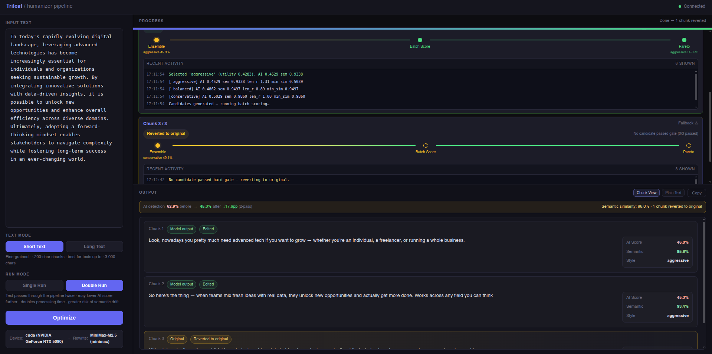
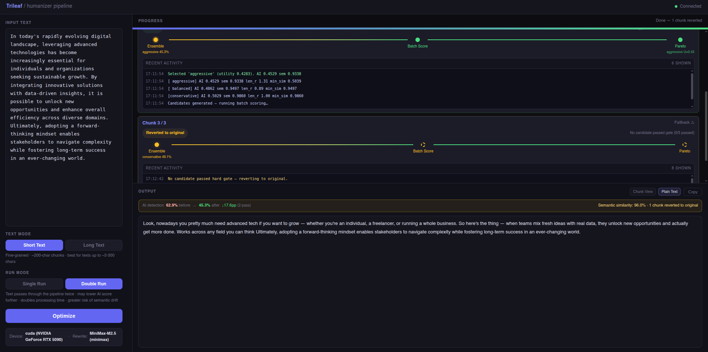

# Trileaf

**Trileaf** is a writing optimizer that is not locked to a single model. Bring the model you already trust, and use it to improve its own drafts through a standardized local optimization pipeline.

It generates an ensemble of rewrite candidates, scores each one on AI-detection probability and semantic fidelity, and uses Pareto-based selection to keep the strongest revision for every chunk. An optional double-pass mode pushes the same text through the pipeline twice, producing writing that feels less uniform and closer to human rhythm.

Scoring uses two local Hugging Face models: [`desklib/ai-text-detector-v1.01`](https://huggingface.co/desklib/ai-text-detector-v1.01) for AI-probability estimation and [`sentence-transformers/paraphrase-mpnet-base-v2`](https://huggingface.co/sentence-transformers/paraphrase-mpnet-base-v2) for semantic similarity.

## Preview





---

## Requirements

| Requirement | Notes |
|-------------|-------|
| Python 3.10+ | 3.12 recommended |
| **LeafHub** | API key management — install first (see below) |
| Internet connection | First-time model download (~0.9 GB) and API calls |
| CUDA GPU | Optional — detection models run on CPU, MPS, or CUDA |

Trileaf uses **[LeafHub](https://github.com/Rebas9512/Leafhub)** for encrypted API key management. LeafHub must be installed and configured before you can run Trileaf. Head to the LeafHub repo to install it and add your provider credentials — the process takes about two minutes.

---

## Install

**macOS / Linux / WSL**

```bash
curl -fsSL https://raw.githubusercontent.com/Rebas9512/Trileaf/main/install.sh | bash
```

**Windows (PowerShell)**

```powershell
irm https://raw.githubusercontent.com/Rebas9512/Trileaf/main/install.ps1 | iex
```

**Windows (CMD)**

```cmd
curl -fsSL https://raw.githubusercontent.com/Rebas9512/Trileaf/main/install.cmd -o install.cmd && install.cmd && del install.cmd
```

The installer prompts for an install directory (default: `~/trileaf`), creates an isolated virtual environment, downloads the detection models (~0.9 GB), and registers the `trileaf` command on your PATH.

---

## Configure

Trileaf reads your API key from LeafHub at startup — no `.env` files needed. After installing LeafHub and adding a provider, link Trileaf to it:

```bash
leafhub register trileaf --path <trileaf-install-dir> --alias rewrite
```

Or let the setup script handle it automatically (runs on first install):

```bash
./setup.sh
```

`trileaf setup` can also be used at any time to self-repair — it installs missing pip dependencies, downloads detection models, and verifies (or auto-repairs) the LeafHub binding.

After registration, `leafhub_dist/LEAFHUB.md` in the Trileaf directory contains the full integration reference, including troubleshooting steps for `credentials: none`.

To switch providers or rotate keys, update them in LeafHub — no changes to Trileaf needed:

```bash
leafhub manage           # Web UI at http://localhost:8765
leafhub project bind trileaf --alias rewrite --provider "Anthropic"
```

---

## Run

```bash
trileaf run
```

Opens the dashboard at **http://127.0.0.1:8001**. If the environment check detects missing models or credentials, `trileaf run` will automatically attempt setup once before retrying.

---

## CLI reference

| Command | What it does |
|---------|-------------|
| `trileaf run` | Start the dashboard server |
| `trileaf setup` | Install dependencies, download models, verify LeafHub binding |
| `trileaf config` | Show LeafHub status and project binding info |
| `trileaf doctor` | Full environment and model health check |
| `trileaf weight` | Show or update Pareto utility weights |
| `trileaf update` | Pull the latest version from git and refresh packages |
| `trileaf stop` | Stop the running server |
| `trileaf remove` | Remove Trileaf, generated files, and PATH entries |
| `trileaf remove --purge-source` | Also delete the source checkout (manual installs) |

Run `trileaf <command> --help` for per-command options.

---

## How the pipeline works

### Core idea

Most AI-detection tools exploit statistical patterns characteristic of LLM output: overly uniform sentence length, predictable phrasing, and low perplexity. Trileaf attacks those patterns directly — but the optimizer is the pipeline, not the rewrite model.

If your model can write, it can also refine its own writing more effectively when wrapped in a disciplined system: diverse rewrite prompts, standardized scoring, hard semantic gates, and deterministic candidate selection. Rather than trusting one rewrite attempt, Trileaf turns each chunk into a controlled competition and picks the version that best trades off detectability reduction against meaning preservation.

### Ensemble strategy

Each chunk goes through three parallel rewrites at different temperatures:

| Style | Temperature | What it changes |
|-------|-------------|-----------------|
| **Conservative** | 0.45 | Word and phrase substitution only — sentence structure frozen |
| **Balanced** | 0.70 | Clause reordering, sentence merging/splitting, burstiness injection |
| **Aggressive** | 0.92 | Deep restructuring — conversational register, varied rhythm, rhetorical devices |

All styles enforce hard factual constraints: facts, numbers, named entities, and core claims must remain unchanged.

### Pareto selection

1. **Hard gate** — candidates that regress on any dimension are dropped (AI score must improve; semantic similarity must exceed 0.65).
2. **Pareto front + utility score** — among passing candidates, non-dominated sorting is applied across both objectives. A weighted utility score picks the winner:

   ```
   U = W_AI × ai_gain_z + W_SEM × sem_z − W_RISK × risk_penalty
   ```

   Default weights: `W_AI = 0.60`, `W_SEM = 0.35`, `W_RISK = 0.05`. Adjustable via `trileaf weight`.

If no candidate passes the gate, the original chunk is kept — the optimizer never silently degrades quality.

### Text modes

| Mode | Chunk size | Best for |
|------|------------|----------|
| **Short text** | ~200 chars | Texts up to ~3 000 chars; largest AI-score reduction |
| **Long text** | ~400 chars | Texts of ~2 000–8 000 chars; preserves rhetorical flow |

### Two-pass optimization

| Mode | Description |
|------|-------------|
| **Single Run** | One optimization pass — default |
| **Double Run** | First-pass output becomes input for the second pass; AI-score deltas reported relative to the original |

---

## Detection models

Two local models score every rewrite candidate. They run locally — no external API:

| Model | Size | Role |
|-------|------|------|
| [`desklib/ai-text-detector-v1.01`](https://huggingface.co/desklib/ai-text-detector-v1.01) | ~0.5 GB | AI-content probability scorer |
| [`sentence-transformers/paraphrase-mpnet-base-v2`](https://huggingface.co/sentence-transformers/paraphrase-mpnet-base-v2) | ~0.4 GB | Semantic similarity measurement |

Downloaded automatically during install. To re-download: `trileaf setup`.

---

## Project structure

```
Trileaf/
├── trileaf_cli.py                     # CLI entry point
├── run.py                             # Server launcher
├── pyproject.toml                     # Package metadata
├── install.sh / install.ps1           # One-liner installers
├── setup.sh / setup.ps1               # Environment setup scripts
│
├── api/
│   ├── optimizer_api.py               # FastAPI app + WebSocket
│   └── static/                        # Dashboard assets
│
├── scripts/
│   ├── check_env.py                   # Health check (trileaf doctor)
│   ├── rewrite_config.py              # Credential resolution
│   ├── app_config.py                  # Config (~/.trileaf/config.json)
│   ├── orchestrator.py                # Pareto-selection pipeline
│   ├── chunker.py                     # Text cleaning + splitting
│   ├── models_runtime.py              # Model loading and inference
│   └── download_scripts/              # HuggingFace downloaders
│
├── tests/                             # pytest test suite
├── models/                            # Downloaded model weights (git-ignored)
└── leafhub_dist/                      # LeafHub integration module (auto-generated)
    ├── probe.py                       #   Stdlib-only runtime detection
    ├── register.sh                    #   Shell function for setup scripts
    ├── LEAFHUB.md                     #   Integration reference and troubleshooting
    └── setup_template.sh              #   setup.sh template for new projects
```

---

## Acknowledgements

- [`desklib/ai-text-detector-v1.01`](https://huggingface.co/desklib/ai-text-detector-v1.01) — AI-probability scorer
- [`sentence-transformers/paraphrase-mpnet-base-v2`](https://huggingface.co/sentence-transformers/paraphrase-mpnet-base-v2) — semantic similarity scorer
- [**LeafHub**](https://github.com/Rebas9512/Leafhub) — local encrypted API key vault, required for credential management
