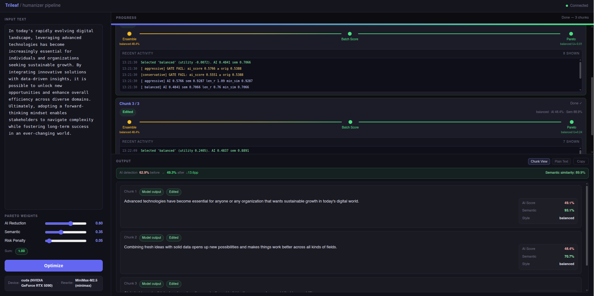

# Trileaf

**Trileaf** is a local AI writing assistant that humanises LLM-generated text. It runs a multi-criteria Pareto-selection pipeline — generating ensemble rewrite candidates and scoring each one on AI-detection probability and semantic similarity — to find the revision that maximally reduces detectability while preserving the original meaning.

Its scoring layer is built on two public Hugging Face models: [`desklib/ai-text-detector-v1.01`](https://huggingface.co/desklib/ai-text-detector-v1.01) for AI-generated-text probability estimation, and [`sentence-transformers/paraphrase-mpnet-base-v2`](https://huggingface.co/sentence-transformers/paraphrase-mpnet-base-v2) for chunk-level semantic similarity and sentence-alignment checks.

## Preview



---

## 1. Getting Started

### Prerequisites

| Requirement | Notes |
|-------------|-------|
| Python 3.10+ | 3.12 recommended |
| Git | For cloning |
| CUDA GPU (optional) | Required only for the optional local rewrite model; detection models run on CPU, Apple Silicon MPS, or CUDA |

### One-liner install (macOS / Linux / WSL)

```bash
curl -fsSL https://raw.githubusercontent.com/Rebas9512/Trileaf/main/install.sh | bash
```

The installer prompts for a clone target directory first. Press Enter to accept the default: `~/trileaf`.

One-liner layout:

- Source checkout + `.venv/` live in the install directory you choose.
- User config lives in `~/.trileaf/`.
- The public command is registered as `~/.local/bin/trileaf`.
- CLI registration tries to append `~/.local/bin` to `~/.bash_profile`. If that write fails, installation still completes and the script prints the exact `export PATH=...` command to run manually.

**Options** (environment variables, set before the pipe):
```bash
TRILEAF_DIR=~/tools/trileaf  curl -fsSL … | bash   # custom install path
TRILEAF_NO_ONBOARD=1         curl -fsSL … | bash   # skip the wizard (CI / headless)
```

### Windows

```powershell
irm https://raw.githubusercontent.com/Rebas9512/Trileaf/main/install.ps1 | iex
```

```cmd
curl -fsSL https://raw.githubusercontent.com/Rebas9512/Trileaf/main/install.cmd -o install.cmd && install.cmd && del install.cmd
```

On Windows, the one-liner follows the same layout:

- Install directory prompt first (default: `%USERPROFILE%\trileaf`)
- Source checkout + `.venv\` inside that install directory
- JSON config files in `%USERPROFILE%\.trileaf`
- `trileaf.exe` exposed through the venv `Scripts\` directory on PATH

### Manual install (clone-and-run)

If you prefer to manage the clone location yourself:

**macOS / Linux / WSL**

```bash
git clone https://github.com/Rebas9512/Trileaf.git trileaf
cd trileaf
chmod +x setup.sh && ./setup.sh
```

**Windows**

```powershell
git clone https://github.com/Rebas9512/Trileaf.git trileaf
cd trileaf
powershell -ExecutionPolicy Bypass -File setup.ps1
```

The manual setup script creates an isolated `.venv/` inside the cloned directory. After it completes, activate the venv before using the `trileaf` command:

```bash
source .venv/bin/activate   # macOS / Linux / WSL — once per terminal session
.venv\Scripts\Activate.ps1  # Windows
trileaf run
```

### After install — start the dashboard

```bash
trileaf run
```

Open **http://127.0.0.1:8001** in your browser.

All Trileaf operations are available as subcommands:

| Command | What it does |
|---------|-------------|
| `trileaf run` | Start the dashboard server |
| `trileaf setup` | Run the setup wizard (download models, configure provider) |
| `trileaf config` | Add or edit rewrite provider profiles |
| `trileaf doctor` | Environment and model health check |
| `trileaf stop` | Stop a running server and release GPU memory |
| `trileaf remove` | Remove Trileaf, generated files, and installer PATH side effects |

Run `trileaf <command> --help` for per-command options.

### Manual setup script flags

| Flag | Effect |
|------|--------|
| `--reinstall` | Delete and recreate `.venv` from scratch |
| `--skip-onboarding` | Skip model download / provider wizard |
| `--headless` | Non-interactive CI mode (implies `--skip-onboarding`) |
| `--doctor` | Run environment check only, then exit |

### Uninstall / clean removal

```bash
trileaf remove
```

One-liner installs are removed completely: the chosen install directory, `~/.trileaf/`, the `trileaf` symlink / PATH entry, generated models, and config are cleaned up.

For a manual source checkout, `trileaf remove` deletes generated files (`.venv`, downloaded models, build artefacts, caches, user config). If you also want to delete the checkout itself:

```bash
trileaf remove --purge-source
```

---

## 2. Onboarding Overview

The setup wizard (`trileaf setup`) walks through four steps. Here is what is required, what is optional, and what hardware you need.

### Step 1 — Python environment check

Verifies torch, sentence-transformers, and huggingface_hub are installed. Automatically satisfied after setup completes.

### Step 2 — Detection models (required local runtime, ~0.9 GB total)

These two models score every rewrite candidate and are the **minimum local requirement** for running Trileaf. They are always required, regardless of which rewrite backend you choose. Both are public Hugging Face repos and download without a HuggingFace account.

| Model | Size | Role |
|-------|------|------|
| [`desklib/ai-text-detector-v1.01`](https://huggingface.co/desklib/ai-text-detector-v1.01) | ~0.5 GB | AI-content probability scorer |
| [`sentence-transformers/paraphrase-mpnet-base-v2`](https://huggingface.co/sentence-transformers/paraphrase-mpnet-base-v2) | ~0.4 GB | Semantic similarity measurement |

In Trileaf, these models are used as follows:

- `desklib/ai-text-detector-v1.01` is the AI-score model. According to its model card, it is a fine-tuned `microsoft/deberta-v3-large` English text classifier that outputs the probability that a passage is AI-generated.
- `sentence-transformers/paraphrase-mpnet-base-v2` is the semantic-preservation model. According to its model card, it maps sentences and paragraphs into a 768-dimensional dense embedding space; Trileaf uses those embeddings for cosine similarity, chunk-level semantic scoring, and worst-sentence alignment checks.

These detection models are downloaded during onboarding and stored locally; they are required even when the rewrite step itself is handled by an external API.

**Hardware for detection-only mode** (external rewrite API): the two scoring models run comfortably on CPU. CUDA is not required; on Apple Silicon they can also run on MPS.

### Step 3 — Rewrite provider (choose one)

The rewrite provider generates candidate rewrites for each chunk. Two backends are available:

#### Option A — External API (recommended for most users)

Connect an external provider or compatible gateway — OpenAI, Anthropic, Groq, Ollama, vLLM, LiteLLM, OpenRouter, and similar services all fit here. No local GPU or local rewrite-model download is required.

The wizard asks for:
- Provider / endpoint URL
- Model name
- API key (stored securely in `~/.trileaf/`, never in the repo)

If Step 2 is green and this provider is configured, Trileaf is ready to run.

Configure or reconfigure at any time:
```bash
trileaf config
```

**Tested and recommended models:** any capable instruction-tuned model works well. Cloud models (GPT-4o, Claude Sonnet, Gemini Pro) tend to produce high-quality rewrites out of the box.

#### Option B — Local Qwen3-VL-8B (optional fully offline mode)

Downloads and runs `Qwen/Qwen3-VL-8B-Instruct` locally. No API key or internet connection needed at inference time.

| Config | VRAM required |
|--------|--------------|
| Scoring models only (detection-only) | ~2 GB or CPU |
| Scoring + local Qwen3-VL-8B (bf16) | ~18 GB minimum, **24 GB recommended** |

> If your GPU has less than 16 GB VRAM, use Option A (external API) for the rewrite step. The scoring pipeline still runs locally and does not require a large GPU.

Download:
```bash
python -m scripts.download_scripts.qwen3_vl_download   # ~16 GB
```

### Step 4 — Final validation

`check_env.py` verifies the two required detection models and the active rewrite profile. Re-run at any time:
```bash
trileaf doctor
```

---

## 3. Project Features

### Core idea

Most AI-detection tools exploit statistical patterns that are characteristic of LLM output: overly uniform sentence length, predictable phrasing, lack of idiomatic variation, and low perplexity relative to a reference distribution. This optimizer attacks those patterns directly.

Rather than applying a single rewrite, it generates **three stylistically distinct candidates** per chunk — conservative, balanced, and aggressive — and uses a multi-criteria selection algorithm to choose the one that best trades off detectability reduction against semantic preservation.

### The ensemble strategy

Each chunk goes through three parallel rewrites at different temperatures and aggressiveness levels:

| Style | Temperature | What it changes |
|-------|-------------|-----------------|
| **Conservative** | 0.45 | Word and phrase substitution only. Sentence structure is frozen. |
| **Balanced** | 0.70 | Clause reordering, sentence merging/splitting, burstiness injection, anti-AI phrasing. |
| **Aggressive** | 0.92 | Deep restructuring — conversational register, free reordering, varied rhythm, rhetorical devices. |

All styles enforce hard factual constraints: facts, numbers, named entities, and core claims must remain unchanged.

### Selection via Pareto optimisation

Generating multiple candidates is only useful if selection is principled. The pipeline uses a two-stage selection process:

1. **Hard gate** — candidates that regress on any quality dimension are dropped:
   - AI score must be lower than the original chunk's score
   - Semantic similarity to the original must exceed a configurable threshold (default: 0.65)

2. **Pareto front + utility score** — among candidates that pass the gate, non-dominated sorting is applied across the two objectives (lower AI probability, higher semantic similarity). Among Pareto-optimal candidates, a weighted utility score picks the winner:

   ```
   U = W_AI × ai_gain_z + W_SEM × sem_z − W_RISK × risk_penalty
   ```

   Default weights: `W_AI = 0.60`, `W_SEM = 0.35`, `W_RISK = 0.05`. Adjustable via dashboard sliders at runtime or in `~/.trileaf/config.json` for persistent defaults.

If no candidate passes the gate, the original chunk is kept unchanged — the optimizer never silently degrades quality.

### Bring your own model

The rewrite backend is fully pluggable. Any OpenAI-compatible API endpoint works, including:

- Cloud providers (OpenAI, Anthropic, Google Gemini, Groq, Mistral, xAI)
- Self-hosted servers (Ollama, vLLM, LiteLLM)
- Regional providers (MiniMax, Moonshot/Kimi, OpenRouter)

Different models produce meaningfully different rewrite styles. A model with stronger instruction-following and natural language fluency will generally produce better candidates — the Pareto selection layer adapts regardless of which model backs it.

**Local development baseline:** Qwen3-VL-8B-Instruct running locally already produces strong results on most writing tasks, with effective AI-pattern avoidance and good factual preservation.

### Multiple provider profiles

The wizard stores named profiles in `~/.trileaf/rewrite_profiles.json`. Switch between them without re-running setup:

```bash
trileaf run --profile my-openai-profile
trileaf config    # add / edit profiles
```

---

## 4. Pipeline Architecture

### Topology overview

```
Input text
    │
    ▼
┌─────────────────────────────────────────────────────┐
│  Chunker                                            │
│  clean_text() → split_text() → chunks               │
│  (paragraph-aware, max ~200 chars per chunk)        │
└───────────────────┬─────────────────────────────────┘
                    │  [chunk₀, chunk₁, … chunkₙ]
                    │
                    ▼  (sequential, one chunk at a time)
┌─────────────────────────────────────────────────────┐
│  Per-chunk pipeline                                 │
│                                                     │
│  Step 0 ── Baseline scoring                         │
│            Desklib(chunk) → orig_ai_score           │
│                                                     │
│  Step 1 ── Ensemble rewrite (parallel × 3)          │
│            rewrite(chunk, "conservative") ──┐       │
│            rewrite(chunk, "balanced")     ──┼──→ candidates[]
│            rewrite(chunk, "aggressive")  ──┘       │
│                                                     │
│  Step 2 ── Batch scoring (per candidate)            │
│            • Desklib      → ai_score                │
│            • MPNet cosine → sem_score               │
│                                                     │
│  Step 3 ── Hard gate                                │
│            drop if ai_score ≥ orig_ai               │
│            drop if sem_score < SEM_GATE (0.65)      │
│                                  │                  │
│                    ┌─────────────┴──────────┐       │
│                 pass                      all fail  │
│                    │                         │      │
│  Step 4 ──  Pareto front             fallback: keep │
│             non-dominated sort         original     │
│             on (−ai_score, sem_score)               │
│                    │                                │
│             Utility score U                         │
│             = W_AI·ai_gain_z + W_SEM·sem_z          │
│               − W_RISK·risk_penalty                 │
│                    │                                │
│             select argmax(U)                        │
│             → best_rewrite                          │
└───────────────────┬─────────────────────────────────┘
                    │  [best_rewrite₀, …, best_rewriteₙ]
                    │
                    ▼
┌─────────────────────────────────────────────────────┐
│  Reassembly                                         │
│  join chunks → output_text                          │
│  Desklib(output_text)   → final_ai_score            │
│  MPNet(input, output)   → final_sem_score           │
└─────────────────────────────────────────────────────┘
                    │
                    ▼
          Dashboard (WebSocket)
          run_done event with scores + per-chunk trace
```

### Real-time feedback

The dashboard receives a WebSocket event stream as the pipeline runs. Each chunk emits:

| Event | Payload |
|-------|---------|
| `chunk_baseline` | Original AI score for this chunk |
| `ensemble_candidates` | The 3 rewrite texts before scoring |
| `chunk_stage` | Progress within the chunk (rewrite → batch_score → pareto) |
| `pareto_selection` | Which candidate won and why (utility scores, gate results) |
| `chunk_done` | Final selected text + scores |
| `run_done` | Aggregate scores across the full document |

### Key configuration parameters

All thresholds and weights are adjustable via dashboard sliders at runtime or via `~/.trileaf/config.json` for persistent defaults:

| Parameter | Default | Description |
|-----------|---------|-------------|
| `SEM_GATE` | 0.65 | Minimum cosine similarity to original (hard gate) |
| `W_AI` | 0.60 | Weight for AI-score reduction in utility |
| `W_SEM` | 0.35 | Weight for semantic preservation in utility |
| `W_RISK` | 0.05 | Penalty weight for borderline candidates |
| `MAX_CHUNK_CHARS` | 200 | Target maximum characters per chunk |

---

## Project structure

```
├── trileaf_cli.py                     # CLI entry point (trileaf run / setup / config / doctor)
├── run.py                          # Server launcher (called by trileaf_cli)
├── pyproject.toml                  # Package metadata — registers the trileaf command
├── install.sh                      # One-liner installer (curl … | bash)
├── setup.sh / setup.ps1           # Manual clone-and-run setup scripts
├── requirements.txt               # Python dependencies
├── api/
│   ├── optimizer_api.py           # FastAPI app + WebSocket broadcast
│   └── static/                    # Packaged dashboard assets
├── scripts/
│   ├── onboarding.py              # First-time setup wizard
│   ├── check_env.py               # Environment / health check (--doctor)
│   ├── orchestrator.py            # Pareto-selection pipeline
│   ├── chunker.py                 # Text cleaning + splitting
│   ├── models_runtime.py          # Model loading, caching, inference
│   ├── rewrite_config.py          # Provider profile store management
│   ├── rewrite_provider_cli.py    # Interactive provider configuration wizard
│   ├── _version.py                # Single version source of truth
│   └── download_scripts/          # Per-model HuggingFace downloaders
│       ├── desklib_detector_download.py
│       ├── mpnet_download.py
│       └── qwen3_vl_download.py
└── models/                        # Downloaded model weights (git-ignored)
```

---

## Acknowledgements

Trileaf builds on several public components:

- [**OpenClaw**](https://github.com/openclaw/openclaw): Trileaf's provider authentication and profile-configuration system is adapted from OpenClaw. The multi-profile credential store, the interactive provider wizard, and the API-key resolution chain (profile → env var → provider-specific fallback) follow patterns established there.
- [`desklib/ai-text-detector-v1.01`](https://huggingface.co/desklib/ai-text-detector-v1.01): public AI-generated-text detection model used by Trileaf as its local AI-probability scorer.
- [`sentence-transformers/paraphrase-mpnet-base-v2`](https://huggingface.co/sentence-transformers/paraphrase-mpnet-base-v2): public sentence-embedding model used by Trileaf for semantic similarity scoring and sentence-alignment checks.

If you are already an OpenClaw user, configuring Trileaf's rewrite backend will feel immediately familiar: you connect a provider in the same way — endpoint URL, model name, API key — and switch between named profiles using the same flow. The profile store lives at `~/.trileaf/rewrite_profiles.json` (analogous to OpenClaw's `~/.openclaw/` directory), so credentials stay outside the repository and are never accidentally committed.

To configure or reconfigure the main model:

```bash
trileaf config
```
